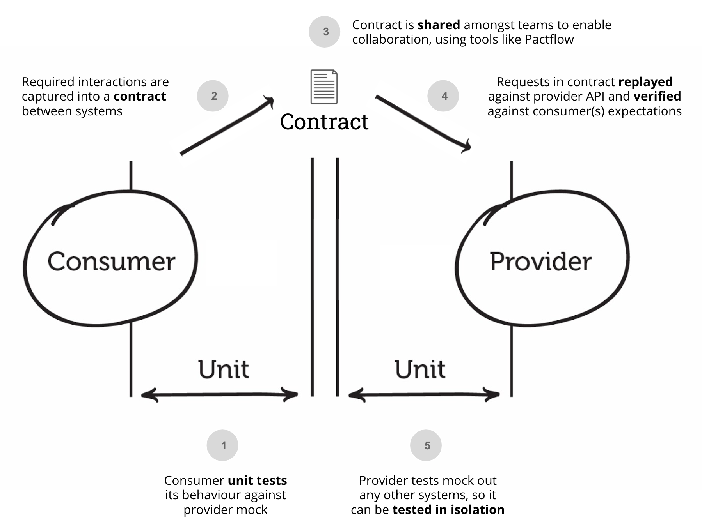

# Ninja - fasten your iteration boost
(To be improved) An auxiliary tool that can automatically generate interface `contract test cases`, reducing the amount of coding for developers, improving code quality, and helping to accelerate product iterations

## What is contract testing?

Contract testing is a technique for testing an integration point by checking each application in isolation to ensure the messages it sends or receives conform to a shared understanding that is documented in a "contract".

For applications that communicate via HTTP, these "messages" would be the HTTP request and response, and for an application that used queues, this would be the message that goes on the queue.

In practice, a common way of implementing contract tests (and the way Pact does it) is to check that all the calls to your test doubles return the same results as a call to the real application would.

## Why need contract test?
Contract testing is important for several reasons:

1. Dependency management: Contract testing helps in managing dependencies between services or components in a distributed system. It ensures that each service understands and adheres to the expected behavior of the other services it interacts with, preventing compatibility issues and runtime failures.

2. Early detection of issues: Contract tests allow you to identify breaking changes or compatibility issues between services early in the development process. By verifying that the contracts are still valid, you can catch potential problems before they propagate downstream and cause more significant issues.

3. Faster development and deployment: Contract testing enables independent development and deployment of services. With well-defined contracts, teams can work on their services in parallel without waiting for other services to be fully implemented. This accelerates the development and deployment process, fostering agility and faster time-to-market.

4. Improved collaboration between teams: Contract testing promotes collaboration among teams responsible for different services. By defining and testing contracts, teams can establish a common understanding of the expected behavior and communication protocols. This facilitates smoother integration, reduces misunderstandings, and enhances overall teamwork.

5. Increased system reliability and stability: Contract testing helps ensure that services communicate correctly and consistently. By verifying the contracts, you can minimize the risk of errors, unexpected behavior, and cascading failures in a distributed system. This ultimately improves the reliability and stability of the entire system.

In summary, contract testing is essential for managing dependencies, detecting issues early, speeding up development and deployment, fostering collaboration, and enhancing system reliability. It is a valuable practice in building robust and scalable distributed systems.

## What capabilities this tool provide?
The focus of this tool is to automatically generate contract test cases. After the developer/tester inputs the parameters and restrictions of the interface into this tool, this tool will generate **boundaries, exceptions, and normal cases** for the interface, and combine it with [Microsoft pict tool]((https://github.com/microsoft/pict)) to generate an appropriate amount of contract test cases. This avoids excessive output due to exhaustive methods.

## Usage

## Architecture
Frontend: React.js + MUI

Backend: express.js

Other Tools: docker, （database）, PICT

## Non-functional requirments
Our team may put emphasis on `Reliability`, `Usability`, `Maintainability`, and `Compatibility`, The specific embodiment is as follows：
> `Reliability`: Write robust code to handle errors and exceptions. Implement appropriate logging and error handling mechanisms to promptly detect and resolve issues. 

> `Usability`: Design intuitive and user-friendly interfaces to ensure users can easily interact with the tool. Provide relevant help documentation and user guides to acquaint users with the tool's features and usage.

> `Maintainability`/ `Testability` : Write clear, modular, and readable code to facilitate future maintenance and modifications. Use comments and documentation to explain code logic and design decisions. Adopt practices like test-driven development (TDD) and unit testing to ensure code quality and maintainability.

> `Compatibility`/ `portability`: Ensure compatibility across different platforms, operating systems, or browsers. Follow standards and specifications for seamless integration and interaction with other systems.

## Other links
- [Pact & Contract Testing](https://docs.pact.io/)
- [Pairwise Independent Combinatorial Testing （PICT）](https://github.com/microsoft/pict)

## Contributors
.